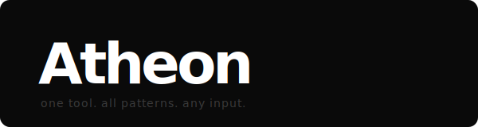

<p align="center">
  
</p>


> **One tool. All patterns. Any input.**

Atheon is a community-driven pattern matching engine. You define what you're looking for. You point it at anything. It finds every match and tells you exactly where returning a clear `true` or `false` for every rule, every time.

---

## What Atheon is

Atheon is a CLI tool built around a single idea: **any pattern, any domain, any input.** It doesn't care whether you're scanning for leaked credentials, patient identifiers, financial account numbers, prohibited strings in compliance-scoped code, or anything else you can describe as a rule. If the pattern is clear if it can return true or false Atheon runs it.

The engine itself is deliberately minimal. It has no opinions about what matters. That knowledge lives in the patterns and the patterns come from the community.

---

## The Mission

Atheon isn't trying to be the next big secrets scanner. It's not competing to become a giant. It's trying to be a **platform**.

Here's the idea: a developer on a team is working with sensitive data. They write a pattern for Atheon, contribute it, and it ships in the next release. Now everyone using Atheon has that pattern registered. The next team in a similar situation doesn't have to build it from scratch it's already there.

That's Atheon: a community-driven engine where you, me, and anyone else can add patterns that every user benefits from. The goal is a library of rules that covers every domain where text contains something that matters built not by one company, but by everyone who uses it.

**Security. Compliance. Finance. Healthcare. Legal. Operations. Gaming. Anything.**

If you can describe the rule, Atheon can run it.

---

## See it in action

[](https://youtu.be/4vlepIzRGqw)

Skip to **9:36** for the live demo, or watch the whole thing to see what Atheon is about.

---

## The scenario that makes this real

A developer wraps up a sprint and pushes a configuration file. Buried in a comment from a debugging session three weeks ago is a production API key. The commit goes through. The pipeline passes. Two months later, someone notices unusual billing activity.

Atheon, wired into a pre-push hook:

```
$ atheon ./

[api-key] config/app.yaml:47  →  # debug key: sk-prod-a8f3c...
```

Exit code `1`. The push never happens. The key never leaves the machine.

That's it. That's the product.

---

## Install

Download the binary for your platform from [Releases](https://github.com/HoraDomu/Atheon/releases/latest). No install, no runtime, no dependencies. Drop it in your PATH and run it.

**Build from source:**

```
go build -o atheon .
```

---

## Usage

```
atheon <path>          scan a directory
atheon --file <path>   scan a single file
atheon --env           scan environment variables
atheon list            list loaded patterns
```

Pipe support:

```
cat file.txt | atheon -
```

Exit code `0` = clean. Exit code `1` = findings. CI-friendly by default.

---

## Contributing

Patterns are the heart of Atheon. Every pattern is one file, two methods small, fast to review, and immediately useful to every user once merged.

See [CONTRIBUTING.md](CONTRIBUTING.md) to add your own.

---

## Releases

Every 3 patterns merged = a new version release. The pattern count drives the version.

Releases are fully automated tagging a version builds all platform binaries and publishes them to GitHub Releases, Homebrew, and Scoop automatically.

Latest release: [github.com/HoraDomu/Atheon/releases/latest](https://github.com/HoraDomu/Atheon/releases/latest)

---

## Contact

Questions, pattern requests, or anything else:

**Email:** [dommcpro@gmail.com](mailto:dommcpro@gmail.com)

---

## License

MIT with Additional Terms Copyright © 2026 Dominick Yanez

You are free to fork, clone, study, modify for personal or internal use, and contribute patterns or bug fixes back. That's encouraged.

What you may not do:
- Ship this software, or any derivative of it, as your own standalone product under a different name or brand
- Remove or obscure the author's name or copyright notice from any copy, fork, or derivative work

For permissions beyond this scope: [dommcpro@gmail.com](mailto:dommcpro@gmail.com)

See the full [LICENSE](./LICENSE) file for complete terms.
